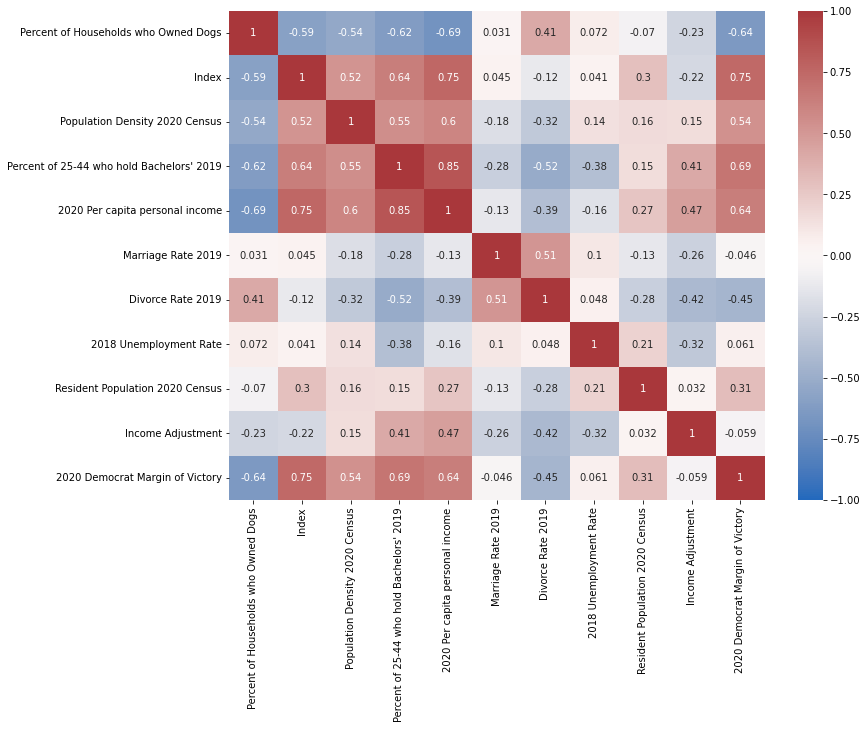
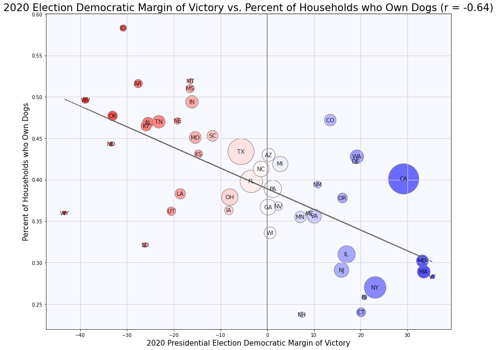
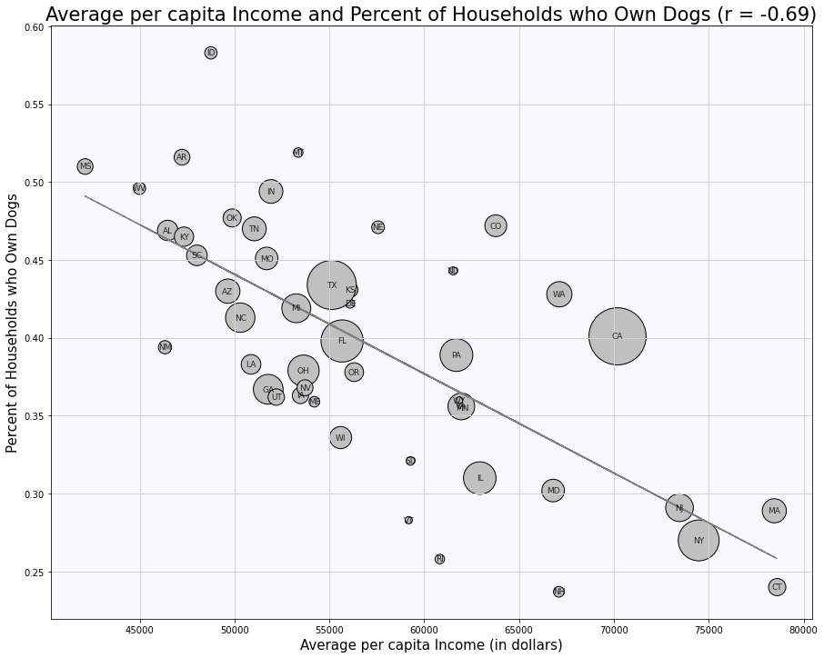
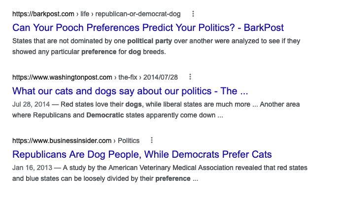

## Dogs and pandas

Heya! In order to settle a debate with a friend (he thinks that SF has a disproportionate dog population because the high cost of living makes raising children that much more expensive), I went to Panda Express, bought my dinner, drove home, opened VSC, and proceeded to regress "Percent of Households who Own Dogs" with over 20 variables (including cost of living) to see if my friend had a point. (I also want to commerate this write-up by saying that I created my first DataFrame ever during this project. Whoo!)

From my original tranche of variables, I found that "2020 per capita Income" had the strongest correlation, with a r = -0.69, and variables "Percent of 25-44 who hold Bachelors' Degree" and "Index" (cost of living index) coming a close second and third, with r = -0.62 and r = -0.59 respectively.

That's when things started to get interesting. I noticed that all the variables I mentioned above not only have a similar r value when regressed with "Percent of Households who Owned Dogs" but also are strongly positively correlated with one another. So high cost of living, dense population, college-educated, and high per capita income... is there a common denominator? As I look at this combination of variables, I think about the headlines of Election 2020 - these variables seem like the perfect profile for a liberal stronghold. Perhaps dog ownership is more than just about money. Perhaps there is a cultural aspect.

I then regressed "Percent of Households who Owned Dogs" with "2020 Democrat Margin of Victory", and found a r = -0.64, a telling correlation. Pretty intriguing!

And to tag back at our original question, here is the scatterplot regressing "Percent of Households who Owned Dogs" with "2020 per capita Personal Income":

The first scatterplot really piqued my interest. When I regressed "Percent of Households who Own Dogs" with a new "Income Adjustment" variable ("2020 per capita Personal Income"/"Index"), I get an r = -0.23, so a slight negative correlation. In any sense, it seems as though money isn't an impediment to dog ownership. Culture (such as political affiliation) seems like a much stronger fit.

I recalled the Time Magazine quiz ["Can TIME Predict Your Politics"](https://time.com/510/can-time-predict-your-politics/feed/) which asks 12 personality questions to guess one's polticial leanings. Surely enough, the first question asked, "I prefer cats to dogs."
A quick Google search yielded similar results:

So back to the original question - why did we think that SF has a disproportionate dog population? If anything, given the City's political lean and cost of living, SF would have a much smaller than average proportion of dogs. Perhaps it was our proximity to Golden Gate Park or the beautiful fall weather that drew out the dog walkers. Perhaps something else.

Nonetheless, my analysis (as every analysis does) leads to more questions than answers. What personality, demographic, and financial traits make a dog owner? Why does it seem that more conservatives perfer to own dogs than liberals? While you all sit tight, let me give my psychology major friend a quick call.

