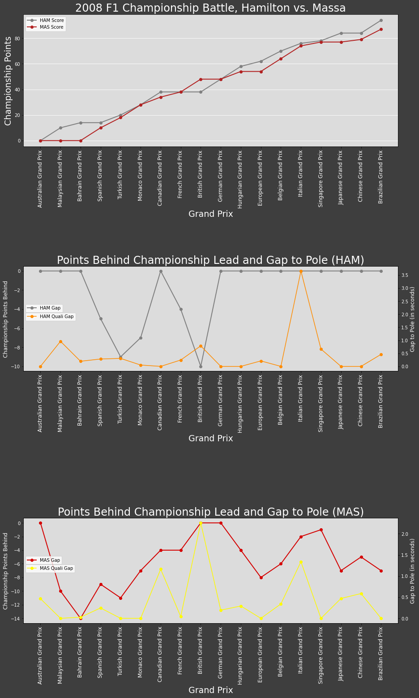
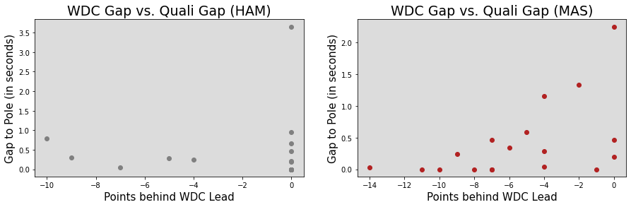
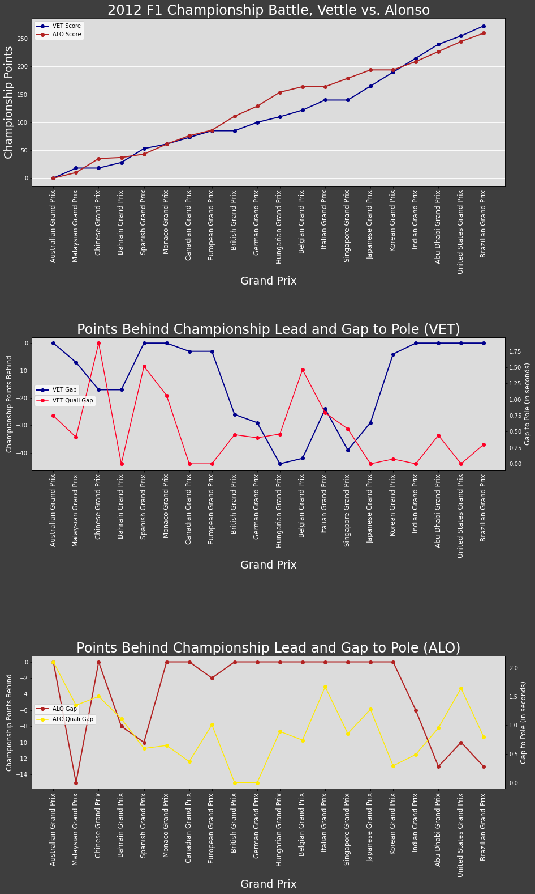
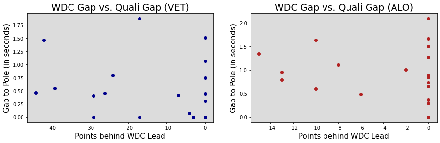
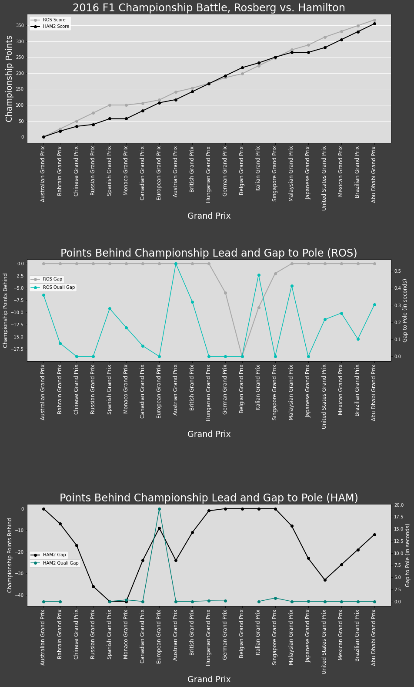
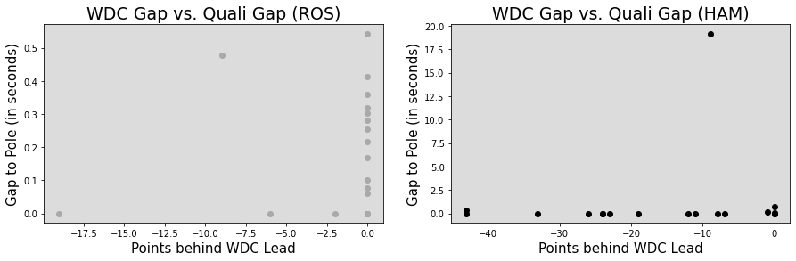
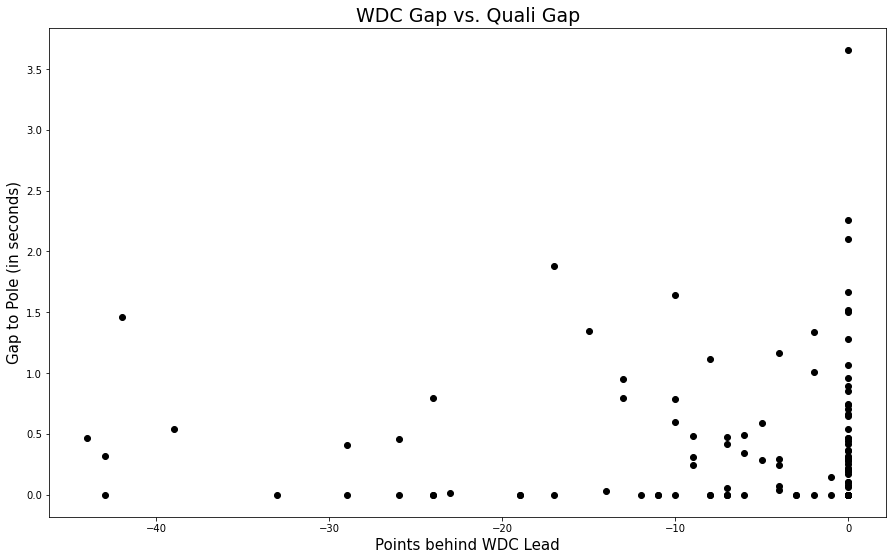

## Mind the Gap 

Oh my god, it has been such a thrilling F1 season. As we enter the last month of races, I think back to the tightest title battles of the last 15 years of so. Three come to mind: Hamilton vs. Massa in 2008 ([what a dramatic ending that was](https://www.youtube.com/watch?v=XHSeGou-pCI)), Vettel vs. Alonso in 2012, and Rosberg vs. Hamilton in 2016. With championship battles that close, I often think that it comes down to who wants it more.

Who wants it more...another thought pops into my head: [reference-dependent preferences](https://www.nber.org/system/files/working_papers/w20343/w20343.pdf) (shoutout to my Behavioral Economics class!).

My Professor pointed out that while the distribution of Boston Marathon finish times is generally normal, we can see spikes at every half-hour mark, with the 4:00 mark the most prominent... why is this? 

In short, reference points (i.e. a 4:00 marathon) serve a goal markers that divide a marathon outcome between the gain domain (sub4:00 marathon success) and a loss domain (above 4:00 marathon failure). With psychological traits such as loss aversion and diminishing sensitivity, there is a significant difference in utility from crossing from the loss to gain domain (i.e. the gain in utility from a 4:01 to a 3:59 marathon is much higher than a gain in utility from a 3:58 to a 3:56 marathon, even though the gap between the two times are the same). In fact, this paper even discusses how toward the end of a race, runners who are comfortably within a 4:00 marathon will slow down, while runners near or slightly above the 4:00 marathon are less likely to slow down and in some cases will speed up - and that this phenomenon is not attributed to a race strategy of conserving energy but to achieving their goal. (The paper also states that runners who finish the marathon with a time of 4:01 are more likely to run the next year compared to those who finish with a time of 3:59.) I interpret these findings to explain that runners - and other athletes such as F1 drivers - have to some extent psychological control over their performance. I'm sure every athlete has heard their coach say that success in their sport is "90% mental, 10% physical." 

Looking at these close F1 title battles, I wondered if title protagonists drove at a higher level if they were in the "loss domain" and let their foot off the gas (pun intended) if they were in the "gain domain." Even Nico Rosberg admitted that in Abu Dhabi 2016 his goal was to come away with P2 and seal the championship rather than fight for the win. The paper I linked above also mentioned that when runners are well behind or well above their goal marathon pace, they will shift their adjustments. For an example, if a runner training for a goal of a 4:00 marathon doesn't think the goal is attainable halfway through the marathon, they may shift their goal to a 4:30 marathon. This should not be an issue for my analysis, as these title fights were extremely close and the championship was never out of range.

With this small analysis, I looked at qualifying performances compared to how far behind the driver was in points in the title race. I would expect the driver to perform better in qualifying if they were behind in the title race (i.e. in the loss domain).

Note: This data wasn't perfect due to reliability issues, sessions that were red flagged, and times when the driver simply didn't make Q3. In which case, I looked on a case-by-case basis to give the driver a pseudo-Q3 time. I will say that after this analysis, I found Hamilton's blaming of his 2016 title loss to engine reliability more plausible.

### 2008

As we can see in the 2008 title race, Lewis Hamilton took the championship lead at around the halfway point of the season and never relinquished, although he fought off a very spirited effort from Felipe Massa in what would turn out to be a title that was won at the last corner of the last race. We can also see that throughout the season, both drivers were well within striking distance of the lead. Yet, when we look at their gap to the championship lead and qualifying performace, we see almost no correlation (a slight positive correlation with Massa). I would expect that toward the end of the season, as the battle tightened between Massa and Hamilton, both drivers would qualify very close to the pole time. Yet, it seems as though qualifying times remained consistent throughout the season regardless of the championship race. The scatterplots below paint the same picture:

When I plot "Points behind WDC Lead" against "Gap to Pole," there is no correlation for Hamilton and a mildly positive correlation for Massa (r = 0.51). So it looks like perhaps Massa performed better in qualifying the farther he was from the championship lead, while Hamilton brought the same consistency day in and day out. Yet, even for Massa, the correlation is not extremely strong, and if I were to take away two or three "outliers," his correlation may have been even weaker.

### 2012

2012 marked a thrilling championship battle between multiple rivals that panned out to be a race between Vettel and Alonso after the second half of the season. If anything, I would've expected Vettel to put in mega qualifying sessions during the first half of the season as he fought against contenders such as Hamilton, Button, and Webber, but he actually performed a little worse in qualifying during the first half of the season compared to the second half. It seems as if Vettel gained confidence (and perhaps familiarity with the car) and hit his stride during the second half. Alonso seemed to perform consistently throughout the season.

As we can see in the scatterplots below, there is little to no correlation between gap to P1 and qualification performance for the two drivers.

### 2016

The first F1 season that I followed closely, this was a thrilling season to the finish. Aside from a few races in the second half of the season, Rosberg led for the majority of the season in an intense championship battle against Hamilton. As we can see in Rosberg's chart, he maintained a consistent qualifying performance throughout the season. When he briefly relinquished the lead to Hamilton, Rosberg didn't have any qualifying times out of the ordinary. Hamilton qualified consistently with the exception of the European Grand Prix, a session in which he crashed out and ended without setting a real fastest lap. I want to bring to attention that this may be the case as to why his qualifying performance looks very consistent. Remember that qualiftying gaps are measured usualy by tenths of a second, so for the one race in which Hamilton qualified nearly 20 seconds behind pole, it threw the scaling way off. (Note that Hamilton had a few GP's in which he didn't set a qualifying time due to engine issues)

As we see once again, there is no real correlation between gap to championship lead and qualifying performance.

### Discussion

I would expect the drivers to perform that much better and extract extra time from their qualifying performances when the stakes got that much higher. However, with the slight exception of Massa, that is not the case - these drivers maintained consistent performances no matter their position in the title fight. There can be a number of factors to explain so:

* Because each driver is limited to a set number of engines, they may need to conserve performance during specific qualifying sessions
* Setup of the car and track conditions can vary dramatically from race to race, and these factors are not in the driver's control
* These drivers are mentally trained to perform their best no matter the circumstances
* Strategy is determined primarily by the team, not the driver

I then made a scatterplot of all the qualifying times and gap to P1 (aside from Hamilton's 2016 European GP qualifying mishap):

Again, no clear correlation. I will also say that I am so sad that I forgot to save my code for this last part, but hey, at least I saved this plot!

I am a bit disappointed that my results are not robust. Nonetheless, I had a great time reliving previous title battles and I am very excited for the Brazilian GP tomorrow morning! Go Max Verstappen!

Update: That was a thrilling GP. Onto next week!
